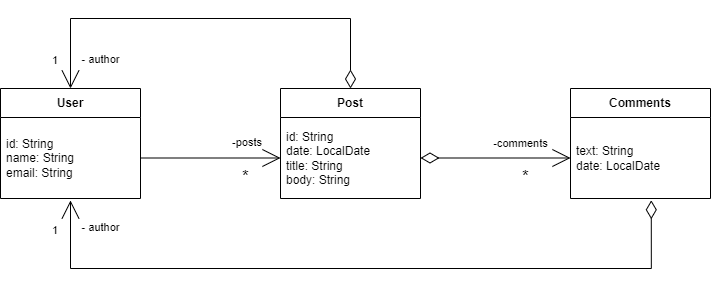

## Spring Boot 3 and MongoDB REST API for Social Media Management

This project demonstrates a RESTful API for managing social media posts, users, and comments using Spring Boot 3 and MongoDB. It covers essential aspects of building a web service, including:

- **RESTful API Design:** Leveraging Spring Web to create well-structured endpoints for interacting with our data model.
- **MongoDB Integration:** Using Spring Data MongoDB for seamless data persistence and retrieval from a MongoDB database.
- **Data Modeling:** Defining entities and relationships to represent users, posts, and comments in a social media context.
- **Custom Exception Handling:** Implementing mechanisms to handle various exceptions and provide informative error responses.
- **Data Initialization:** Pre-populating the database with sample data using the `Instantiation` class for immediate testing and development.

### Author

- [Lucas Bandeira](https://github.com/LucasBandeiraSilva)

### Domain Model


- Diagram adapted from the Course Java COMPLETO Programação Orientada a Objetos + Projetos taught by [Nelio Alves](https://github.com/acenelio)

### Features

- **User Management:** Create, read, update, and delete user profiles.
- **Post Management:** Create, read, update, and delete posts associated with users.
- **Comment Management:** Add, retrieve, and manage comments on posts.
- **Full-text Search:** Search for posts based on keywords in their titles and bodies.
- **Date-based Filtering:** Retrieve posts within a specific date range.

### Technologies Used

- Spring Boot 3
- Spring Data MongoDB
- Spring Web
- MongoDB
- Java 17 (or higher)
- Maven

### Getting Started

1. **Install MongoDB:**
    - Download MongoDB for Windows from the official website: [https://www.mongodb.com/pt-br/docs/manual/tutorial/install-mongodb-on-windows/](https://www.mongodb.com/pt-br/docs/manual/tutorial/install-mongodb-on-windows/)
    - Follow the installation instructions in the documentation.

2. **Clone the Repository:**
   ```bash
   git clone https://github.com/your-username/your-repo-name.git
   cd your-repo-name
   ```

3. **Build the Project:**
   ```bash
   mvn clean install
   ```

4. **Run the Application:**
   ```bash
   mvn spring-boot:run
   ```

### API Endpoints

**Base URL:** `http://localhost:8080`

#### User Resource

| Method | Endpoint        | Description                     |
| :----- | :--------------- | :------------------------------ |
| GET    | `/users`        | Retrieve all users             |
| GET    | `/users/{id}`     | Retrieve a user by ID          |
| POST   | `/users`        | Create a new user             |
| PUT    | `/users/{id}`     | Update an existing user         |
| DELETE | `/users/{id}`     | Delete a user by ID          |
| GET    | `/users/{id}/posts` | Retrieve posts by a specific user |

**Example Request (Creating a User):**

```http
POST /users
Content-Type: application/json

{
  "name": "Bruce Wayne",
  "email": "bruce@gmail.com"
}
```

#### Post Resource

| Method | Endpoint            | Description                                 |
| :----- | :------------------ | :------------------------------------------ |
| GET    | `/posts/{id}`       | Retrieve a post by ID                      |
| GET    | `/posts/titlesearch` | Search for posts by title                  |
| GET    | `/posts/fullsearch`   | Search for posts by title, body, and date |

**Example Request (Searching for Posts by Title):**

```http
GET /posts/titlesearch?text=road
```

**Example Request (Searching for Posts by Title and across dates):**

```http
GET /posts/fullsearch?text=enjoy&minDate=2018-03-22&maxDate=2018-03-27
```

## Contributing

Feel free to contribute to this project by opening issues or submitting pull requests.

## License

This project is licensed under the MIT License. 
